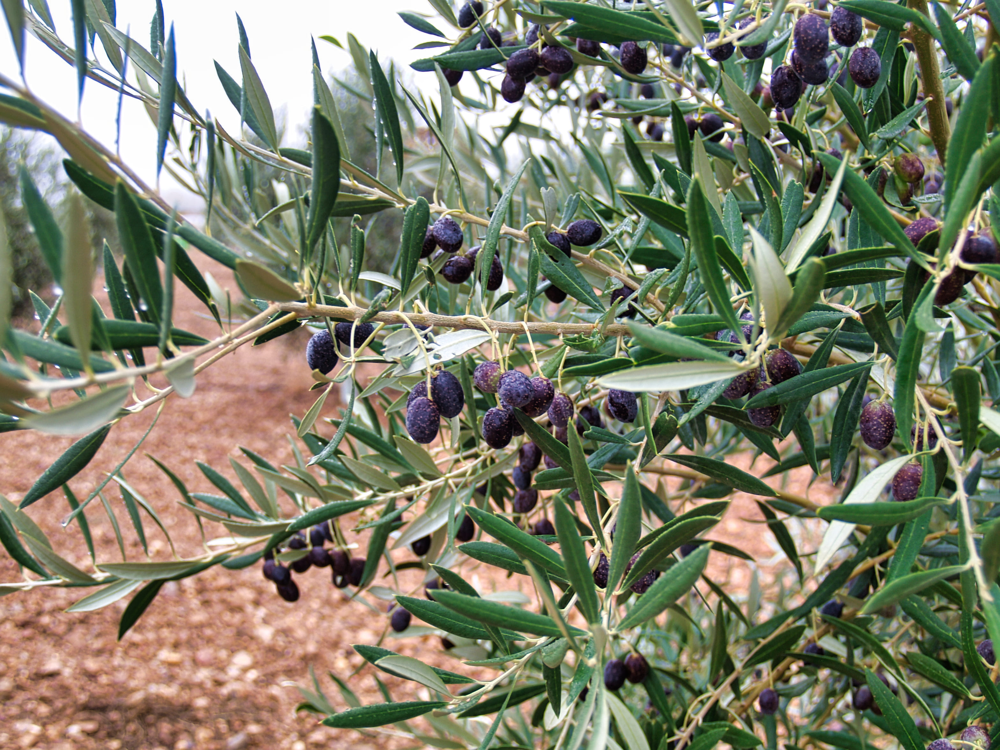
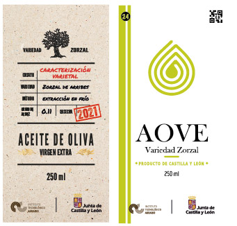
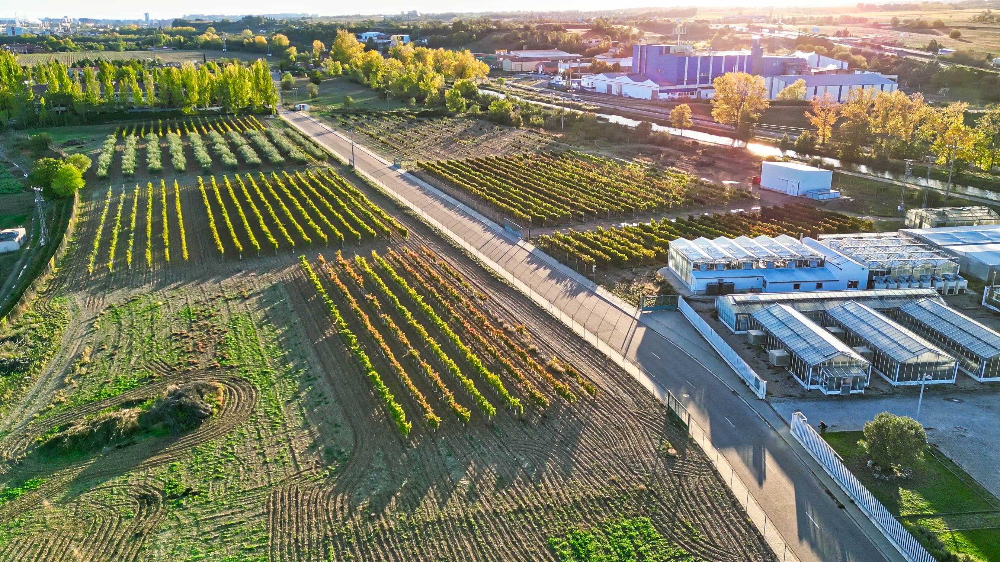

## Variedad de Olivo Zorzal: Un Tesoro de Castilla y León

Bienvenidos a nuestro espacio dedicado a celebrar y preservar la variedad de olivo Zorzal, una joya agrícola única en la región de Castilla y León. Esta variedad autóctona simboliza la riqueza y diversidad del patrimonio natural de nuestra región, demostrando la importancia de conservar nuestras tradiciones agrícolas mientras abrazamos prácticas sostenibles.

### Orígenes y Características
El olivo Zorzal se distingue por su adaptación excepcional al clima y terreno específicos de Castilla y León, lo que resulta en un aceite de oliva virgen extra de calidad superior. Con árboles robustos y resistentes, esta variedad produce aceitunas que ofrecen un perfil de sabor único, apreciado tanto a nivel local como internacional.

### El Aceite
El aceite producido por la variedad Zorzal se caracteriza por su equilibrado amargor y picante, con notas aromáticas que recuerdan a la hierba fresca, almendra, y toques frutales. Estas cualidades lo hacen excepcionalmente versátil en la cocina, ideal tanto para platos tradicionales de Castilla y León como para innovaciones culinarias.

### El olivar en Arribes
El origen del cultivo del olivo en los Arribes del Duero data de la ocupación de los árabes. el área geográfica de distribución de la variedad de olivo "Zorzal de Arribes" está ubicada al Noroeste de la provincia de Salamanca y al Suroeste de la provincia de Zamora. Fruto de las propecciones realizadas en la zona se ha encontrado la variedad Zorzal. se trata de una variedad reconocida en la región y que no se encuntra en ninguna otra zona de producción y diferente a cualquiera de las conservadas en el Banco Mundial de Germoplasma de Olivo localizado en Córdoba. En estos momentos la variedad Zorzal ha despertado interés en los Arribes del Duero ya que constituye un incentivo de desarrollo en la línea de producción de aceites diferenciados y su producción prodía resultar en una diferencia competitiva en el mercado del aceite producido en Castilla y León  
El ITACyL  ha realizado un trabajo de caracterización de esta variedad , comprometiéndose a conservarla, proporcionando material vegetal a cuantos viveros lo soliciten. Para garantizar la calidad del material vegetal de origen de esta variedad, fue enviada a la Oficina Española de Variedades Vegetales para su inclusión en el registro de variedades de conservación

### Visítanos
Te invitamos a explorar más sobre la variedad de olivo Zorzal visitando nuestras plantaciones. Descubre el proceso detrás de la creación de nuestro excepcional aceite de oliva virgen extra y sumérgete en la belleza natural de Castilla y León.

Para más información, contacta con nosotros a través de nuestro formulario de contacto.
[Formulario](https://ee.kobotoolbox.org/x/BdkKhP7d).
Si quieres compartir tus impresiones de cata, puedes hacerlo siguendo nuestra ficha
[Instrucciones]
[Ficha de Cata](https://ee.kobotoolbox.org/x/BdkKhP7d).

